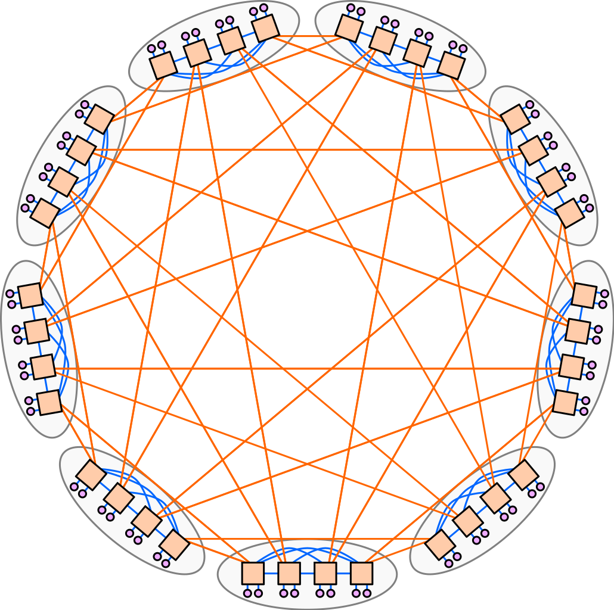

# DragonFly Network Topology

## Prologue

The DragonFly is a network topology intended for HPC infrastructure as it is a real improvment in network performances.  
As we can see in the diagram, the DragonFly topology is constructed from groups of nodes interconnected via communication links that are carefully organized. This organization allows for high-bandwidth and low latency connections.

## Structural Characteristics

The structure of the DragonFly topology is what makes its efficiency and effectiveness in HPC environments. The network design based on innovative node arrangement, robust communication links and effective scalability features contribute to optimizing data communication while reducing delays and resource wastage. 

### Node Arrangement and Organization

Each node represents